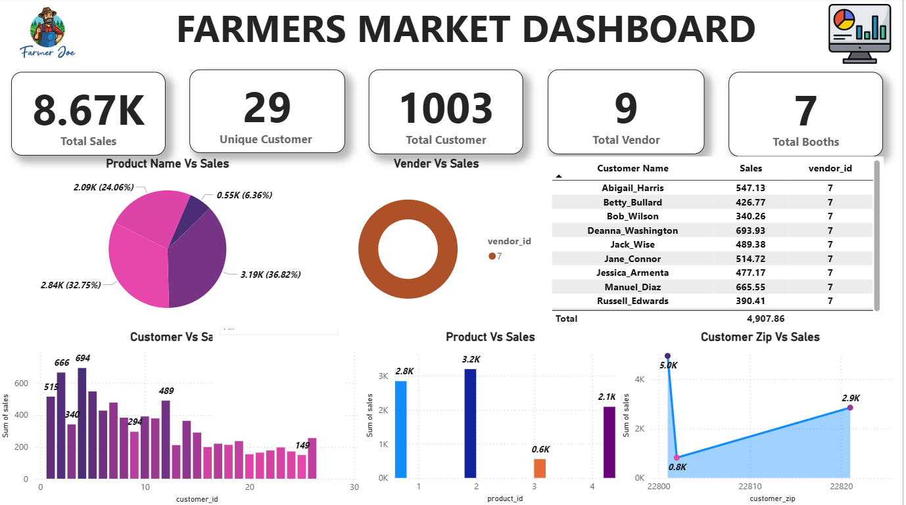
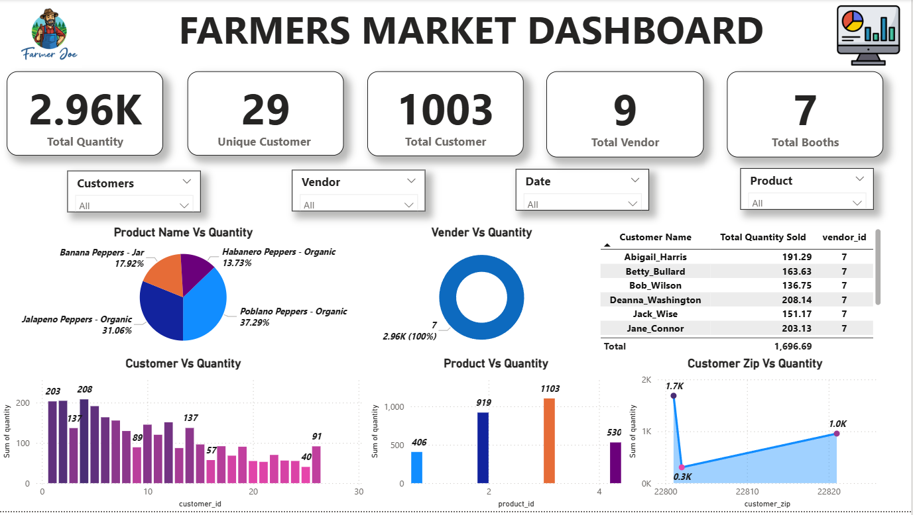

# 🌾 Farmers Market Sales Dashboard – Power BI

This project showcases an interactive Power BI dashboard designed to analyze farmers market sales performance.  
It provides valuable insights into customer demand, product movement, vendor performance, and revenue trends.

---

## 📊 Project Overview

This dashboard helps understand:

- Total Quantity Sold  
- Total Sales Generated  
- Active Vendors  
- Unique Customers  
- Booth Distribution  
- Product-wise Performance  
- Customer Contribution  
- Regional Behavior (ZIP-based)  
- Vendor-wise Sales & Quantity Trends  

The goal is to help farmers and market management make data-driven decisions.

---

## 🧾 Dashboard Pages Included

- Quantity Wise Analysis  
- Sales Wise Analysis  
- Sales Performance Analysis  

---

## 📌 Key Insights Identified

### ⭐ Customer Insights
- High variation in customer purchasing behavior  
- Small number of customers contribute to major revenue  
- ZIP **22820** generates the highest sales  

### ⭐ Product Insights
- Poblano, Jalapeno, Habanero, and Banana Peppers lead in sales  
- Product performance varies across vendors  

### ⭐ Vendor Insights
- Vendor 7 dominates sales and quantity  
- Vendor contribution differs by product category  

---

## 📸 Dashboard Preview

### 📊 Sales Analysis

### 📦 Quantity Analysis

---

## 📁 Repository Contents

| File | Description |
|------|------------|
| Farmer_Sales_analysis.pbix | Power BI dashboard |
| resources.zip | Raw dataset files |
| Images/ | Dashboard screenshots |
| README.md | Documentation |
| LICENSE | License file |

---

## 🗃 Dataset Included (inside resources.zip)

- booth.csv  
- customer.csv  
- customer_purchases.csv  
- market_date_info.csv  
- product.csv  
- product_category.csv  
- vendor.csv  
- vendor_inventory.csv  
- vendor_booth_assignments.csv  

---

## 🔧 Data Cleaning Performed

- Removed duplicate entries  
- Standardized date formats  
- Cleaned product names  
- Merged lookup tables  
- Created KPI measures  
- Fixed inconsistent values  

---

## 🛠️ Tools & Techniques Used

- Power BI  
- Power Query  
- DAX  
- Excel / CSV  
- Data Modeling  

---

## 🧠 Skills Applied

- Data Cleaning  
- Data Modeling  
- ETL (Extract Transform Load)  
- KPI Development  
- Data Visualization  
- Business Analytics  
- Insight Generation  

---

## 👨‍💻 Developed By

**Kunal Chandelkar**
